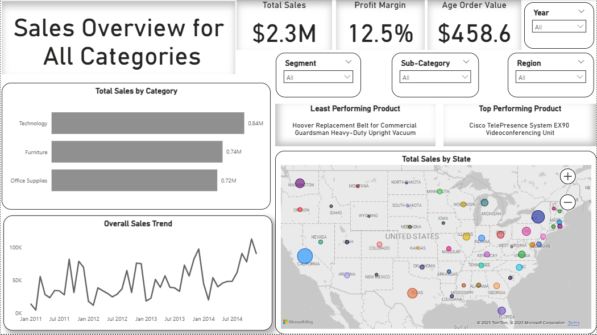
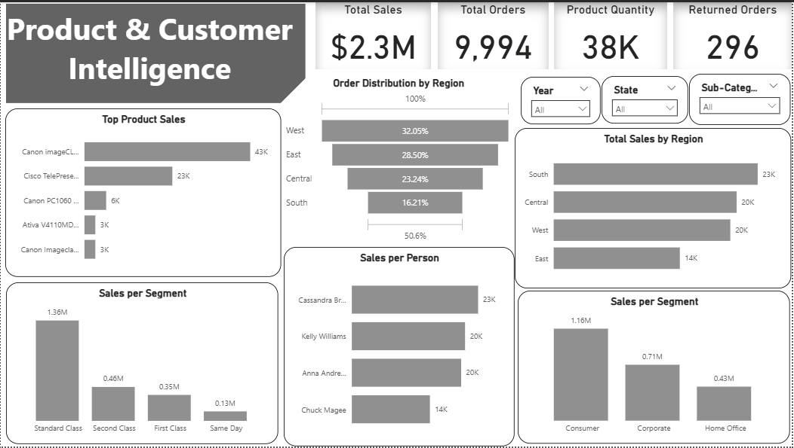

# 🛍️ Product & Customer Intelligence Dashboard

## 📊 Overview
This repository contains a professional, interactive dashboard built using **Power BI** and **Excel**, designed to analyze e-commerce sales data. The dashboard empowers business owners and decision-makers to uncover insights into sales performance, product trends, and regional revenue distribution.

---

## 🎯 Purpose
The dashboard addresses key business questions:

- 📌 What are the best-selling products?
- 📆 When do sales peak during the year?
- 🌍 Which categories or regions generate the most revenue?

---

## 🚀 Features

- **Top Product Sales**: Highlights best-selling products like *Canon imageCLASS* and *Cisco TelePresence*.
- **Order Distribution by Region**: Visualizes sales across West, East, Central, and South regions.
- **Sales per Segment**: Breaks down sales by customer segments (Consumer, Corporate, Home Office).
- **Sales per Person**: Tracks individual contributions (e.g., Cassandra, Kelly Williams).
- **Total Sales by Category**: Compares revenue across Technology, Furniture, and Office Supplies.
- **Overall Sales Trend**: Displays performance over time (2011–2014).
- **Geographical Insights**: Maps total sales by U.S. state.
- **Key Metrics**:
  - Total Sales: **$2.3M**
  - Total Orders: **9,994**
  - Product Quantity: **38K**
  - Returned Orders: **296**
  - Profit Margin: **12.5%**
  - Average Order Value: **$458.6**

---

## 📈 Insights from Analysis

- **Monthly Sales Trends**: Sales show a general upward trend from 2011 to 2014, with peaks in mid-2013 and early 2014 — likely tied to holidays or product launches.
- **Category-wise Performance**: Technology leads with **$0.8M**, followed by Furniture and Office Supplies (~$0.7M each).
- **Customer Behavior**: The Consumer segment dominates with **$1.1M** in sales, driven by top performers like Cassandra (**$23K**) and Kelly Williams (**$20K**). Returned orders are minimal, indicating strong satisfaction.

---

## 💡 Recommendations

- **Focus on Technology**: Boost inventory and marketing for high-performing tech products like *Cisco TelePresence*.
- **Seasonal Campaigns**: Launch promotions during mid-year and early-year periods to leverage historical peaks.
- **Sales Team Optimization**: Incentivize top performers to further drive Consumer segment growth.
- **Regional Expansion**: Prioritize the West region (**32.5%** of orders) and explore growth in the South (**16.1%**).

---

## 🧾 Conclusion
The dashboard reveals a robust e-commerce operation with strong technology sales and a growing consumer base. By leveraging seasonal trends and optimizing regional and sales strategies, the business can enhance revenue and market presence. This tool provides a solid foundation for data-driven decision-making and sustainable growth.

---

## 📷 Sample Dashboard Visuals

### 🔝 Sales Performance Overview

### 🌍 Product & Customer Intelligence

---

## 📂 Repository Contents
- `dashboard.pbix` – Power BI dashboard file
- `sales_data.zip` – Raw sales data
- `README.md` – Project documentation

---

## 🧠 Skills Demonstrated
- Data cleaning & transformation
- Time series trend analysis
- DAX for KPIs
- Business storytelling with visuals
- Excel/CSV data handling

---

